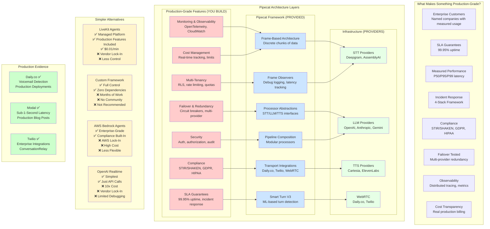

# Pipecat Production-Grade Architecture Diagram

## Visual Explanation: Pipecat vs Alternatives



---

## Architecture Layers Explained

### Layer 1: Infrastructure (Providers)
**What**: STT/LLM/TTS providers, WebRTC infrastructure
**Who Provides**: Deepgram, OpenAI, Cartesia, Daily.co, Twilio
**Your Role**: Choose providers, configure API keys

### Layer 2: Pipecat Framework (Provided)
**What**: Frame-based architecture, processor abstractions, transports
**Who Provides**: Pipecat open-source framework
**Your Role**: Use framework, compose pipelines

### Layer 3: Production-Grade Features (You Build)
**What**: Monitoring, failover, compliance, SLA, multi-tenancy, security
**Who Provides**: You (or managed platform)
**Your Role**: Build these features on top of Pipecat

---

## Comparison Matrix

| Framework | Complexity | Production Features | Cost | Control | Lock-In |
|-----------|-----------|-------------------|------|---------|---------|
| **Pipecat** | Medium | ❌ You build | Low | High | None |
| **LiveKit Agents** | Low | ✅ Included | Medium | Medium | Medium |
| **Custom Framework** | High | ❌ You build | Low | Very High | None |
| **AWS Bedrock** | Low | ✅ Included | High | Low | High |
| **OpenAI Realtime** | Very Low | ✅ Included | Very High | Very Low | Very High |

---

## Decision Tree

```
Do you want full control?
├─ YES → Do you have engineering resources?
│   ├─ YES → Use Pipecat (build production features)
│   └─ NO → Use LiveKit Agents (managed platform)
│
└─ NO → Are you already on AWS?
    ├─ YES → Use AWS Bedrock Agents
    └─ NO → Are you prototyping?
        ├─ YES → Use OpenAI Realtime
        └─ NO → Use LiveKit Agents
```

---

## Key Insight

**Pipecat = Infrastructure Framework**
- Provides: Frame-based architecture, processors, transports
- You Build: Production-grade features (monitoring, failover, compliance)

**Managed Platforms = Framework + Production Features**
- Provides: Everything (framework + production features)
- Trade-off: Less control, vendor lock-in, higher cost

**Custom Framework = Build Everything**
- Provides: Nothing (you build everything)
- Trade-off: Full control, but months of work

---

## Simple ASCII Architecture Diagram

```
┌─────────────────────────────────────────────────────────────┐
│           PRODUCTION-GRADE FEATURES (YOU BUILD)             │
│  ┌──────────┐ ┌──────────┐ ┌──────────┐ ┌──────────┐       │
│  │Monitoring│ │ Failover │ │Compliance│ │   SLA    │       │
│  └──────────┘ └──────────┘ └──────────┘ └──────────┘       │
│  ┌──────────┐ ┌──────────┐ ┌──────────┐                    │
│  │Multi-Ten │ │ Security │ │   Cost   │                    │
│  └──────────┘ └──────────┘ └──────────┘                    │
└─────────────────────────────────────────────────────────────┘
                            ↓
┌─────────────────────────────────────────────────────────────┐
│              PIPECAT FRAMEWORK (PROVIDED)                   │
│  ┌──────────┐ ┌──────────┐ ┌──────────┐ ┌──────────┐       │
│  │  Frames  │ │Processors│ │Transports│ │Smart Turn│       │
│  └──────────┘ └──────────┘ └──────────┘ └──────────┘       │
│  ┌──────────┐ ┌──────────┐                                  │
│  │Observers│ │Pipeline   │                                  │
│  └──────────┘ └──────────┘                                  │
└─────────────────────────────────────────────────────────────┘
                            ↓
┌─────────────────────────────────────────────────────────────┐
│              INFRASTRUCTURE (PROVIDERS)                      │
│  ┌──────────┐ ┌──────────┐ ┌──────────┐ ┌──────────┐       │
│  │   STT    │ │   LLM    │ │   TTS    │ │  WebRTC  │       │
│  │Deepgram  │ │  OpenAI  │ │ Cartesia │ │  Daily   │       │
│  │AssemblyAI│ │ Anthropic│ │ElevenLabs│ │  Twilio  │       │
│  └──────────┘ └──────────┘ └──────────┘ └──────────┘       │
└─────────────────────────────────────────────────────────────┘

═══════════════════════════════════════════════════════════════

                    ALTERNATIVES COMPARISON

┌──────────────────────────────────────────────────────────────┐
│  LiveKit Agents          │  Custom Framework                │
│  ✅ Managed Platform     │  ✅ Full Control                 │
│  ✅ Production Features  │  ✅ Zero Dependencies            │
│  ✅ $0.01/min            │  ❌ Months of Work              │
│  ❌ Vendor Lock-In       │  ❌ Not Recommended              │
└──────────────────────────────────────────────────────────────┘

┌──────────────────────────────────────────────────────────────┐
│  AWS Bedrock Agents      │  OpenAI Realtime                 │
│  ✅ Enterprise-Grade     │  ✅ Simplest                     │
│  ✅ Compliance Built-In  │  ✅ Just API Calls               │
│  ❌ AWS Lock-In          │  ❌ 10x Cost                     │
│  ❌ High Cost            │  ❌ Vendor Lock-In                │
└──────────────────────────────────────────────────────────────┘

═══════════════════════════════════════════════════════════════

                    PRODUCTION EVIDENCE

  Daily.co ✅          Modal ✅           Twilio ✅
  Voicemail Detection  Sub-1-Second       Enterprise
  Production           Latency            Integrations
  Deployments          Production         ConversationRelay
```

---

## What Each Layer Provides

```
┌─────────────────────────────────────────────────────────────┐
│ LAYER 3: Production-Grade Features                           │
│ YOU BUILD: Monitoring, Failover, Compliance, SLA, Security │
│ TIME: Weeks to months of engineering                        │
└─────────────────────────────────────────────────────────────┘
                            ↓
┌─────────────────────────────────────────────────────────────┐
│ LAYER 2: Pipecat Framework                                  │
│ PROVIDED: Frame architecture, processors, transports       │
│ TIME: Hours to days (use existing framework)               │
└─────────────────────────────────────────────────────────────┘
                            ↓
┌─────────────────────────────────────────────────────────────┐
│ LAYER 1: Infrastructure Providers                           │
│ PROVIDED: STT/LLM/TTS APIs, WebRTC                          │
│ TIME: Minutes (configure API keys)                          │
└─────────────────────────────────────────────────────────────┘
```

---

## The Key Difference

**Pipecat (Open-Source Framework):**
```
You = Framework + Production Features
     ↓
  [Pipecat] + [Your Code] = Production System
```

**LiveKit Agents (Managed Platform):**
```
You = Configuration Only
     ↓
  [LiveKit] = Production System (everything included)
```

**Custom Framework:**
```
You = Everything
     ↓
  [Your Code] = Production System (build from scratch)
```
